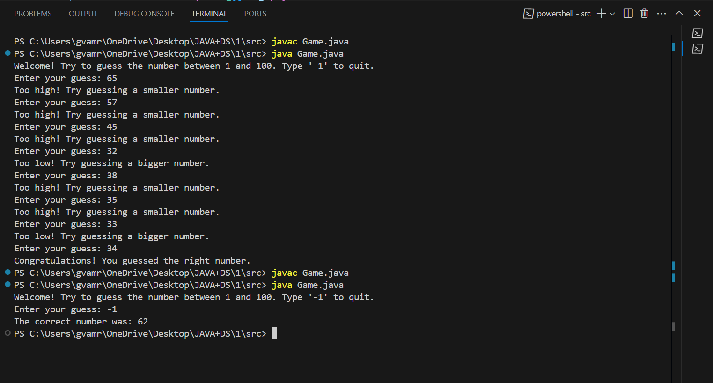

# 🎯 Number Guessing Game (Java)

A simple **Number Guessing Game** built using **Java**.

## 🚀 Features
- The program randomly selects a number.
- The user guesses the number based on hints.
- Displays the number of attempts taken.

## 🛠️ How to Run
1. Clone this repository:
   ```bash
   git clone https://github.com/pranathi-vnr/NumberGuessingGame.git

2. Navigate to the project directory:
   cd NumberGuessingGame

## Compile and run the program:
   javac NumberGuessingGame.java
   java NumberGuessingGame

## 📸 Screenshot  

